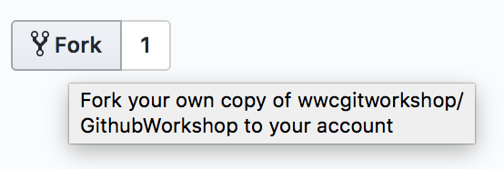
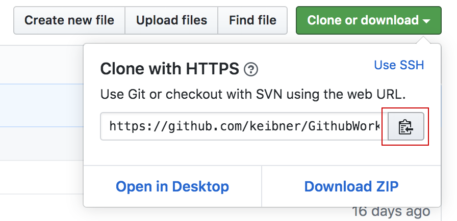
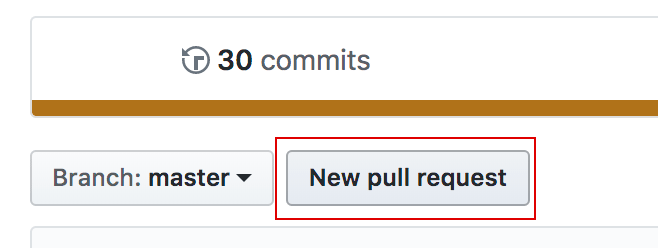
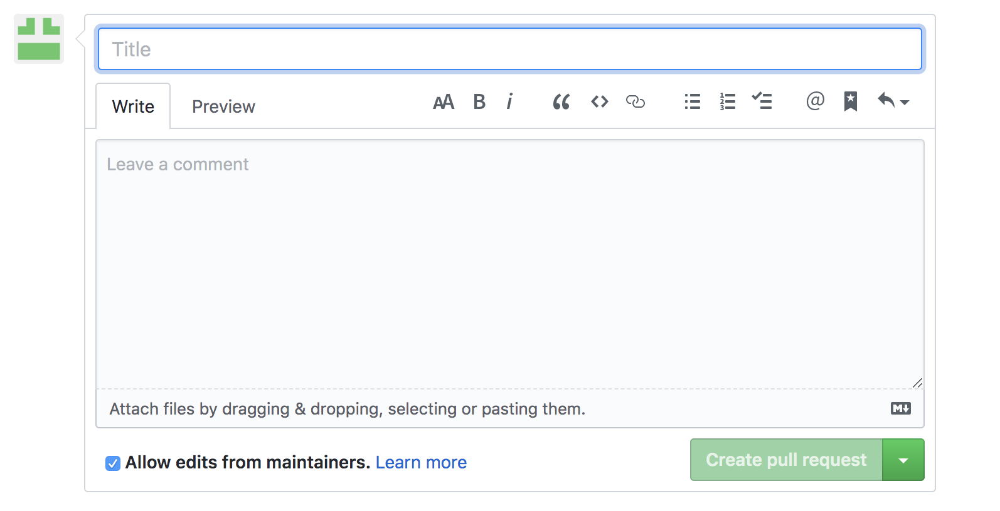

# Git Workshop
[Github Cheat Sheet](https://github.github.com/training-kit/downloads/github-git-cheat-sheet.pdf "Github Cheat Sheet")


## Fork the remote respository



## Create your local respository

Create a folder for the repository:
```bash
$ mkdir <folder_name>
$ cd <folder_name>
```

Clone the fork into your new folder:
```bash
$ git clone https://github.com/<username>/GithubWorkshop

```




Go into the git directory:
```bash
$ cd GithubWorkshop

```

Review the remote repository:
```bash
$ git remote -v [-v | --verbose]
```

Open the Readme.md in your text editor


## Git Manual

Review help topics:

```bash
$ git help
```
>**TIP:** exit help by simply typing *q*

Review git branch:

```bash
$ git help branch
```

## Create and modify a local branch

Create a new feature branch:
```bash
$ git branch <feature_yourname>
$ git checkout <feature_yourname>
$ git branch -a
```
*shorthand version*
```bash
$ git checkout -b <feature_yourname>
```

Create a new file: **your_name.txt**

Copy this into <your_name.txt> file:

     Your name:
     Why you came to the workshop?
     Is this your first event?
     Favorite ice cream flavor?
     What is the name of the person sitting to the right and left of you?
     Do you want to contribute to open source in the future? 

Check the status of your changes: 
```bash
   $ git status
``` 
*Your file is not being track by git, we need to add it*

Add your_name.txt to the repo:
```bash
  $ git add . <your_name.txt>
  $ git status
```
>TIP: *git add* stages your changes. You cannot commit your changes until you have first staged them.

Check the status again to see the staged file:
```bash
  $ git status
```

Remove delete_me.txt from your repo:
```bash
  $ git rm delete_me.txt
  $ git status
```

```
Run a diff on the changes:
*good practice is to run a diff before every commit*
```bash
   $ git diff origin
```
Commit your changes: 
*"Commit early and commit often"*
```bash
   $ git commit 
   $ git status
``` 

>**TIP:**
Use git commit, rather than the shorthand
git commit -m "Add your commit message here"

Do a git log to see your changes:
```bash
   $ git log
```

Add a new line of text to your_name.txt

Run a diff on the changes:
```bash
   $ git status
   $ git diff origin
```
Stage your changes: 
```bash
   $ git add .
   $ git status
```
>**TIP:**<br/>   
>*git add .* stages new files and modifications, without deletions<br/> 
>*git add -A* stages all changes<br/> 
>*git add -u* stages modifications and deletions, without new files<br/> 


Commit your changes: 
```bash
   $ git commit
```

Push your branch to the remote: 
```bash
   $ git push -u origin <feature_yourname>
   $ git status
```
>**TIP:** You only need the *-u* command if your branch is not already upstream 


## Merge your branch into master


First review all the branches:
```bash
   $ git branch -a
```

Checkout Master:
```bash
   $ git checkout master 
```

Pull updates from the remote:
```bash
   $ git pull 
```
>**TIP:** *git pull* merges changes from the remote into your local copy. Use *git fetch* if you simply want to download the latest to keep track of what is going on. You will then need to merge to incorporate the updates from *fetch*.

Now merge your changes into master
```bash
  $ git merge <feature_yourname>

```

Push master to your origin
```bash
   $ git push origin
```

## Create your PR

Go to your github and click 'pull request'




Comapre changes and submit your message




resolve merge conflicts


## Delete your branch

```bash
   $ git push --delete origin <feature_yourname>
   $ git branch -d <feature_yourname>
```
